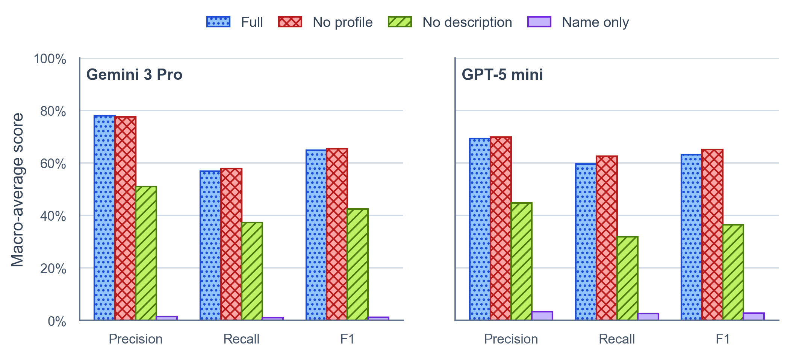

# UrbanTrace Benchmark

## Quantitative Ablation: Dataset Discovery Performance

Dataset discovery is the first and most open-ended step in UrbanTrace. This benchmark evaluates whether the discovery agent can recover the datasets needed for a realistic urban analysis goal, and whether retrieval quality comes from structured metadata, dataset-level descriptions, or from dataset names alone.

The benchmark is designed as a controlled ablation over the dataset context shown to the agent at inference time. The central question is whether richer metadata grounding helps the agent map a high-level planning or policy objective to the right local data layers.

## Benchmark Tasks and Data Lake Scope

The benchmark contains **28 real-world urban research scenarios** built over a curated NYC OpenData lake of **112 profiled geospatial datasets**. Each case consists of:

- a natural-language prompt describing a realistic urban research or planning goal;
- a manually validated gold set of core relevant datasets, typically **3 to 5** per case;
- supporting references that ground the task in real policy, planning, or public-service contexts.

The prompts describe the analytical objective without explicitly naming the correct datasets, so the benchmark measures **semantic dataset discovery** rather than keyword matching.

> Repository note: the paper-facing benchmark refers to **112 profiled datasets**. In the current checkout, [`data/geojson_raw/`](../data/geojson_raw/) contains one additional raw GeoJSON asset without a matching metadata profile in [`data/metadata_raw/`](../data/metadata_raw/), so the ablation setup should be interpreted against the 112 profiled datasets.

## Task Construction and Annotation

The benchmark was constructed with an **LLM-assisted, human-validated** workflow. Candidate research scenarios were first proposed from trusted public sources such as NYC government materials, NYC OpenData, agency reporting, and related policy documents. Those candidates were then manually curated, rewritten for realism and ambiguity, and validated against the datasets actually available in the UrbanTrace repository.

This process was intended to preserve realistic discovery conditions: the agent must connect a high-level analysis goal to the appropriate local datasets, common geography, and analytical framing, while avoiding trivial name-based retrieval.

Detailed task rationales, gold mappings, and references are maintained in [`benchmark/cases/`](./cases/). The runner-facing manifest lives in [`benchmark/urbantrace_agent_benchmark.json`](./urbantrace_agent_benchmark.json).

## Ablation Conditions

For each benchmark task, the discovery agent receives the task prompt together with an ablation-specific view of the local dataset catalog and returns a set of recommended dataset identifiers.

| Condition | Context shown to the agent |
| --- | --- |
| `name_only` | Dataset identifiers / names only |
| `no_profile` | Names plus dataset descriptions |
| `no_description` | Names plus structured profile metadata |
| `full` | Names, descriptions, and structured profile metadata |

This isolates the contribution of lexical names, structured profiles, and dataset-level semantic descriptions to urban dataset discovery.

## Evaluation Protocol

The paper evaluates the discovery agent with two model backbones:

- **Gemini 3 Pro** (`@vertexai/gemini-3-pro`)
- **GPT-5 mini** (`@gpt-5-mini/gpt-5-mini`)

For each combination of task, model, and ablation condition, the benchmark runs the discovery process **5 times** to account for stochastic variance in LLM outputs.

Predictions are scored against the manually validated gold dataset set using **precision**, **recall**, and **F1** over set overlap. Raw accuracy is not emphasized because the discovery problem is highly imbalanced: most datasets in the lake are irrelevant to any one task, so true negatives would dominate the metric.

## Main Results

The paper reports strong performance for the full discovery configuration across both model families:

- **Gemini 3 Pro**: precision `0.779`, recall `0.569`, F1 `0.648`
- **GPT-5 mini**: precision `0.693`, recall `0.596`, F1 `0.632`

The main ablation finding is that **dataset descriptions are the dominant source of retrieval gain**. Removing descriptions causes large drops in F1:

- **Gemini 3 Pro**: `0.648 -> 0.424`
- **GPT-5 mini**: `0.632 -> 0.365`

At the other extreme, the **`name_only`** condition performs near zero across metrics, showing that realistic urban dataset discovery cannot be solved from dataset names alone.

Removing explicit profile context changes performance far less than removing descriptions, which is consistent with the paper's interpretation that much of the useful profile signal has already been distilled into the descriptions shown at inference time.



The result barplots are stored under [`benchmark/results/`](./results/), with the current checked-in figure at [`benchmark/results/ablation1_results.png`](./results/ablation1_results.png).


## Reproducing the Benchmark

Run all commands from the repository root.

Install backend dependencies:

```bash
pip install -r backend/requirements.txt
```

The runner loads `backend/.env` first and then `.env`. Configure the backend model provider as needed, including `LLM_PROVIDER` and the matching credential/model variables for either Portkey or OpenAI.

To reproduce the paper-style ablation, run all four conditions with five repeated trials per case and write to a fresh output path:

```bash
python3 benchmark/scripts/run_dataset_discovery_benchmark.py \
  --ablation all \
  --runs 5 \
  --llm-model @vertexai/gemini-3-pro \
  --output benchmark/results/dataset_discovery_results_gemini.csv
```

```bash
python3 benchmark/scripts/run_dataset_discovery_benchmark.py \
  --ablation all \
  --runs 5 \
  --llm-model @gpt-5-mini/gpt-5-mini \
  --output benchmark/results/dataset_discovery_results_gpt5mini.csv
```

The runner appends to the target CSV, so use a new `--output` path for clean benchmark runs. Each row records the case, ablation, run index, predicted dataset IDs, and the resulting precision/recall/F1 scores.

For smaller debugging runs, the runner also supports `--max-cases`, `--start-from`, and single-ablation execution via `--ablation`.

## Benchmark Assets

- [`benchmark/urbantrace_agent_benchmark.json`](./urbantrace_agent_benchmark.json): machine-readable benchmark manifest consumed by the runner
- [`benchmark/cases/`](./cases/): per-case benchmark writeups, gold mappings, and supporting references
- [`benchmark/scripts/run_dataset_discovery_benchmark.py`](./scripts/run_dataset_discovery_benchmark.py): discovery benchmark runner
- [`benchmark/scripts/visualize_results.ipynb`](./scripts/visualize_results.ipynb): notebook for aggregating and plotting result CSVs
- [`benchmark/results/`](./results/): saved benchmark outputs and rendered figures
